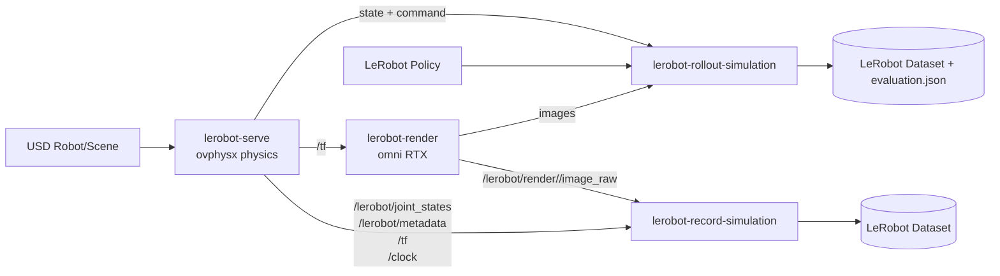

# LeRobot Simulation Skills 架构介绍

## 1. 背景：为什么拆分 Isaac Sim

- **Isaac Sim 是庞大的一体化软件包**：仿真、渲染、UI、扩展系统、资产工具链都在同一个 Kit/Isaac 应用栈中，组件多、依赖重、冷启动慢。
- **MuJoCo 的内置渲染器适合快速调试**，但在材质、光照、相机效果和合成数据真实性方面较弱，不适合作为高质量视觉数据的唯一来源。
- 我们的选择：把 Isaac Sim 里真正需要的能力拆出来，形成 **物理仿真、RTX 渲染、数据记录、策略评测** 四类可组合 skill。

## 2. 目标：Isaac Sim 核心拆分 + LeRobot 数据格式

- 以 **LeRobot 数据格式** 为统一输入/输出契约，让仿真数据、真实机器人数据和策略评测结果可以复用同一套训练/可视化工具链。
- 以 ROS 2 topic 作为 skill 间的低耦合接口：物理 skill 发布关节状态和 TF，渲染 skill 订阅 TF 并发布图像，记录/评测 skill 订阅状态与图像并写 LeRobot dataset。
- skill 框架目标：
  - 可替换物理引擎：当前 standalone `ovphysx`，后续可接其他引擎。
  - 可替换渲染器：当前 `omni.hydra.rtx`，后续尝试 Blender 等离线/实时渲染器。
  - 可插拔机器人、本体、场景、资产重建和渲染增强能力。

## 3. 总体架构

- `lerobot-serve` 只负责物理、关节控制、状态/TF/metadata 发布。
- `lerobot-render` 只负责根据 TF 更新 USD prim 姿态并输出多相机图像。
- `lerobot-record-simulation` 负责生成 demonstration dataset。
- `lerobot-rollout-simulation` 负责加载策略、闭环控制仿真并输出评测数据。

## 4. lerobot-serve：可插拔物理仿真

- 当前实现使用 standalone `ovphysx`，脚本说明为“Run a USD articulation in standalone ovphysx and bridge it to ROS 2”。
- 启动时加载 USD、创建 PhysX tensor binding，绑定 articulation 的 DOF 位置、速度、目标、effort、root pose 和 link pose。
- ROS 合约：
  - 发布 `/lerobot/joint_states`、`/lerobot/root_pose`、`/tf`、`/lerobot/metadata`、`/clock`。
  - 订阅 `/lerobot/command`，按关节名把位置/速度/力矩写回 ovphysx target。
- 多机器人场景下，关节名可加 `<root>::<joint>` 前缀；MOZ01 可以通过 `--control-profile moz01` 展开四连杆夹爪耦合关系。
- 设计要点：用 ROS topic 封装物理引擎，未来替换物理后只要维持相同 topic/metadata 合约即可。

## 5. lerobot-render：可插拔渲染器

- 当前实现使用 Omniverse Kit + `omni.hydra.rtx`，不启动完整 Isaac Sim。
- PowerShell launcher 自动寻找 `kit.exe`，注入 skill 自带 app 和 extension folder，并把 USD、相机、分辨率、端口等作为 Kit setting 传入。
- Extension 打开 USD 后切换到 session layer；若场景没有灯光，会临时加 dome/key light；自动发现 USD Camera 或读取 sensors JSON。
- ROS image bridge 通过 loopback TCP 向 Kit extension 请求 frame，订阅 `/tf`，并发布 `/lerobot/render/<sensor>/image_raw`。
- 当前已尝试兼容 Blender 作为替代渲染后端，但在现阶段帧率太低，暂不作为默认实时数据采集路径。

## 6. lerobot-record-simulation：自动采集 LeRobot 数据

- 用途：自动拉起或连接 serve/render 后，将仿真 demonstration 写成兼容 LeRobot 的本地 dataset。
- 记录内容：
  - `observation.state`：当前关节位置，使用 ROS joint-name order。
  - `action`：同一关节顺序下发送给 `/lerobot/command` 的目标。
  - `observation.images.<sensor>`：每个渲染 sensor 的 RGB 图像。
  - `task`：默认任务描述为从随机初始关节姿态移动到固定目标姿态。
- 支持 `--sensors auto|none|name1,name2`：自动发现 `/lerobot/render/*/image_raw`，或录制纯 proprioception 数据。
- 每个 episode 先随机 reset 到 goal 附近，再用 smoothstep 轨迹生成专家动作；最后 `save_episode()`、`finalize()` 并重新打开 dataset 做校验。

## 7. lerobot-rollout-simulation：仿真环境自动评测

- 用途：自动拉起或连接 serve/render，在仿真环境中加载本地或 Hugging Face LeRobot checkpoint，进行闭环 rollout。
- 工作流：
  1. 发现 joints 和 sensors，创建与当前仿真一致的 LeRobot dataset features。
  2. 加载 LeRobot policy、preprocessor、postprocessor。
  3. 每个 episode 随机 reset，循环执行 observation → policy inference → action → ROS command。
  4. 保存 rollout dataset，并写 `evaluation.json`。
- 指标：每集 reset error、final/minimum goal error、success、inference latency、control overrun；聚合 success rate、mean final error、P95 latency 等。
- 这样评测结果既能被程序读取，也能用 LeRobot dataset viewer 做人工复盘。

## 8. 后续扩展路线

- **本体配置 skill**：如 `moz-robot-setup`，负责 robot morphology、关节命名、控制 profile、传感器挂载等配置。
- **场景搭建 skill**：如 `oven`，负责任务场景、交互物体、随机化参数和评测目标。
- **资产重建 skill**：从扫描/图片/网格重建 USD asset，并补齐碰撞、材质、尺度和语义信息。
- **渲染增强 skill**：负责材质增强、光照随机化、domain randomization、合成数据质量检查。
- 终局形态：以 LeRobot dataset 和 ROS topic contract 为核心协议，把 physics/render/record/rollout/asset/scene/robot skills 组合成可复用智能体仿真工厂。
